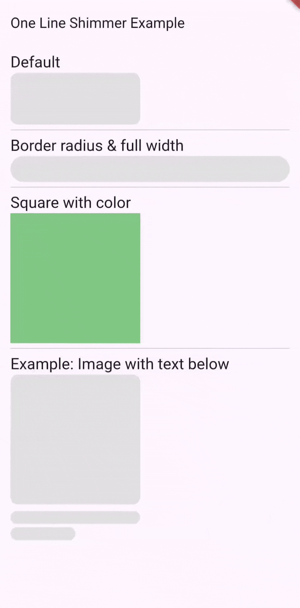

# One Line Shimmer

A lightweight and customizable one-line shimmer widget for Flutter apps, Supports custom colors, animation speed, and rounded borders.



## Features

✅ Lightweight  
✅ One-line usage  
✅ Custom duration and colors  
✅ Fully responsive

## Getting Started

Add dependency in `pubspec.yaml`:

```yaml
dependencies:
  one_line_shimmer: ^1.0.1
```

## One Line Usage
```
OneLineShimmer(width: 200, height: 20),
```

## Full Usage
```
OneLineShimmer(
  width: 200,
  height: 20,
  borderRadius: BorderRadius.circular(16), //optional
  milliseconds: 1000, //optional
  baseColor: Colors.grey.shade100, //optional
  shimmerColors: [
    Colors.grey.shade300,
    Colors.grey.shade200,
    Colors.grey.shade100,
  ], //optional
),
```

## Parameters
| Parameter       | Description                                    | Required   |
| --------------- | ---------------------------------------------- | ---------- |
| `width`         | Width of shimmer box                           | Yes        |
| `height`        | Height of shimmer box                          | Yes        |
| `borderRadius`  | Optional border radius                         | No         |
| `milliseconds`  | Animation speed in milliseconds (default: 750) | No         |
| `baseColor`     | Background color of box                        | No         |
| `shimmerColors` | Exactly 3 shimmer gradient colors              | No         |

## Author

- [BodyKh](https://github.com/Abdulrhman-Khaled)

## License

This project is licensed under MIT License - see the [LICENSE](./LICENSE) file for details.
